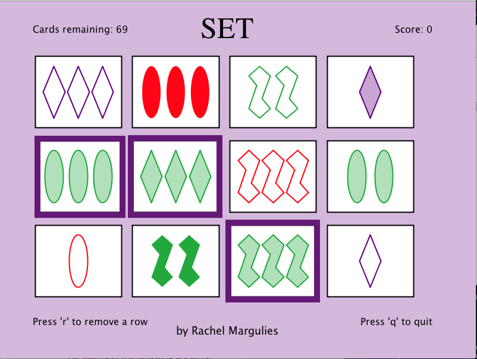
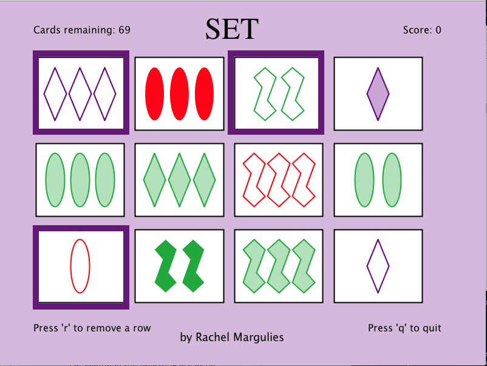
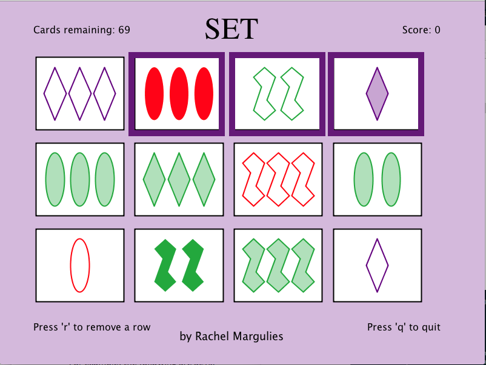

# Set Logic Game (Solitaire)
A solo, interactive game of Set, created in java.

# To Play
- Download source code
- Double-click SetGameplay.class

# Rules (From [Set Enterprises] (http://www.setgame.com/)):
- The object of the game is to identify a SET of 3 cards from 12 cards placed face up on the table. Each card has four features, which can vary as follows:
	- Shape
		- Ovals
		- Squiggles
		- Diamonds
	- Color
		- Red
		- Green
		- Purple
	- Number
		- One
		- Two
		- Three
	- Pattern
		- Empty
		- Shaded
		- Solid
- A SET consists of 3 cards in which each of the cards’ features, looked at one‐by‐one, are the same on each card, or, are different on each card. All of the features must separately satisfy this rule. In other words: shape must be either the same on all 3 cards, or different on each of the 3 cards; color must be either the same on all 3 cards, or different on each of the 3, etc. See Examples below.
- A QUICK CHECK ‐ Is it a SET?
	- If 2 cards are the same and 1 card is different in any feature, then it is not a SET. For example, if 2 are red and 1 is purple then it is not a SET. A SET must be either all the same OR all different in each individual feature.
- STUCK?
	- If you cannot seem to find a set in the gameboard shown, try pressing the 'R' key to remove a column at random.
	- If you give up, try pressing the 'Q' key to quit the current game and start a new one.

# Points
- In my solitaire version of this classic game, points are calculated with one point is awarded for each uniquness among the features of the cards in the SET.
- Since each of the 81 cards in the deck is unique, a SET must have at least one unique feature among the cards. Thus, points per SET range from 1-4.

# Examples 
- This shows a set where the three cards have the same color, number, and pattern, with unique shape for each. It would be worth 1 point.

- This shows a set where the three cards have the same pattern, with unique shape, color, and number for each. It would be worth 3 points.

- This shows a set where the three cards have unique shape, color, number, and pattern for each. It would be worth 4 points.

